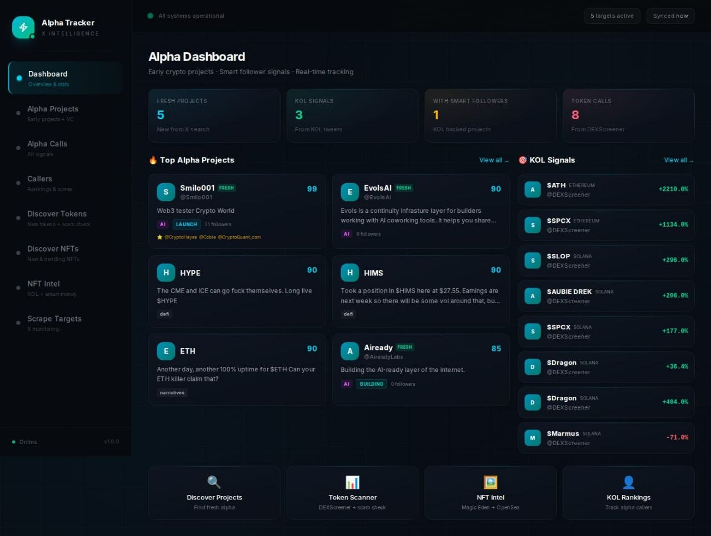

# LavAlpha

Crypto intelligence dashboard. Track alpha calls, KOL signals, and smart-follower activity across chains in one dense dashboard.



## Why

Most "crypto signal" UIs are loud, neon, and shallow. They show one number per card and call it a day.

LavAlpha goes the other direction. It assumes you already know what you are looking at and gets out of the way. The dashboard is dense, dark, and numbers-first. JetBrains Mono for figures, Inter for everything else, no purple gradients, no glow effects, no carousel-fade-in animations. The accent color (teal `#2dd4bf`) is used sparingly so it actually means something when it shows up.

## What it does

- **Alpha Calls feed** — every call from a tracked X/Twitter caller, parsed and tagged (token, chain, contract, sentiment, MCap)
- **Caller leaderboard** — score, win-rate, total calls, recent activity
- **Project tracking** — fresh signals + KOL signals, with smart-follower overlap so you can see who else is watching
- **Discover** — Tokens, NFTs, NFT Intel — pulled from on-chain + market sources
- **Targets** — personal watchlist with quick checks
- **Distribution stats** — chain breakdown, sentiment split, 24h activity sparkline

All data lives in a single SQLite file via Prisma. The Python scraper writes calls and mentions in the background, the Next.js app reads.

## Stack

- **Frontend:** Next.js 15 App Router, React 19, Tailwind v4, TypeScript
- **Backend:** Next.js API routes, Prisma ORM
- **DB:** SQLite (`prisma/dev.db`)
- **Scraper:** Python daemon (`scraper/daemon.py`) writes to the same DB

## Quickstart

```bash
# install
npm install

# generate prisma client + migrate
npx prisma generate
npx prisma db push

# dev mode
npm run dev

# production
npm run build
npm start
```

App runs on port 3000 by default. To use 3333:

```bash
npx next start -p 3333
```

## Project layout

```
src/
  app/                  Next.js App Router pages
    page.tsx            Dashboard (stats + top projects + latest calls)
    projects/           Tracked projects (fresh + KOL)
    alpha-calls/        Full call feed with filters
    callers/            KOL leaderboard + caller detail
    discover/
      tokens/           Token discovery
      nfts/             NFT discovery
      nft-intel/        NFT-focused intel view
    targets/            Personal watchlist
    api/                API routes (alpha-calls, projects, callers, stats, daemon, security/check, ...)
  components/
    Sidebar.tsx         220px navigation, SVG icons
    AlphaCallCard.tsx   Call row
    CallerBadge.tsx     Caller pill with score
    StatsCard.tsx       Sparkline stat block
    SearchFilter.tsx    Generic filter
prisma/
  schema.prisma         DB schema (Project, Caller, AlphaCall, ...)
scraper/
  daemon.py             Python scraping daemon
  ...
docs/
  preview.jpg           Dashboard screenshot
```

## Design system

- **Surfaces:** `#08080a -> #131316 -> #19191d` layered grays. Borders sit at `rgba(255,255,255,0.04-0.07)` so they barely exist.
- **Type:** Inter 13px body, JetBrains Mono for all numbers, small uppercase tracking labels for stat captions.
- **Color:** semantic only (green / red / amber / blue / purple), each with a 6% bg tint for badges. No gradients. No glow.
- **Density:** small radii (3-7px), tight padding, 1px hairline tables, sticky headers.
- **Charts:** mini sparklines per stat card, distribution bars for chain + sentiment splits.

## API routes

- `GET /api/alpha-calls?limit=50` -- recent calls
- `GET /api/projects` -- tracked projects
- `GET /api/callers` -- KOL list
- `GET /api/stats` -- aggregate counts + distributions
- `GET /api/tokens/discover` -- token discovery
- `GET /api/security/check` -- token / contract checks
- `POST /api/daemon` -- scraper control

## Roadmap

- [ ] Live websocket updates for the calls feed
- [ ] Per-caller PnL tracking
- [ ] On-chain whale crossover with calls
- [ ] Export to CSV / Notion
- [ ] Multi-DB (Postgres) for production

## License

Private. Not for redistribution yet.
